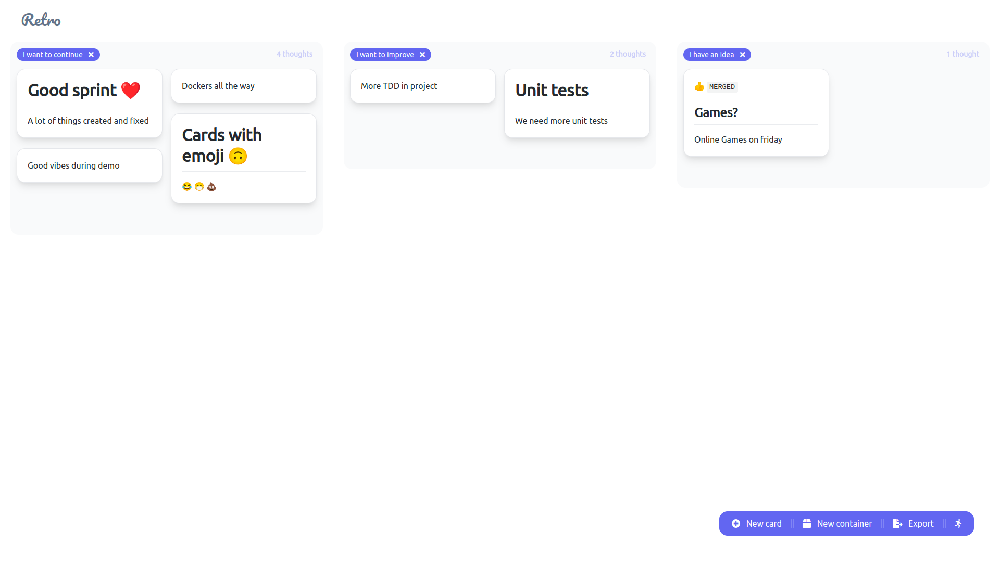

# Retro - Definitive retrospective tool for agile teams

# Warning!
### This app is still work in progress. Do not use it in production yet.

## How to start
Follow the scripts in `package.json` or just run `yarn deploy`. 

App will start at [http://localhost:4200/](http://localhost:4200/)

## Features
Create session for your team.

Every member can add cards that will be revealed at retro meeting. 
Cards can be styled with markdown and emojis.
 

During the meeting you can group similar cards. Export all after meeting.

